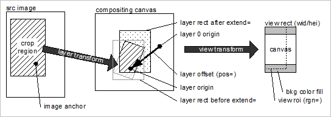

# 레이어 배치{#layer-placement}

레이어 원점(origin=)을 배경 레이어 원점과 함께 pos=로 지정된 오프셋에 정렬하여 레이어를 배치합니다.

이미지 레이어에 레이어 원점을 명시적으로 지정하지 않으면 다음과 같이 계산됩니다.

1. 이미지 앵커를 결정합니다. 또는 지정하지 `anchor=`않은 경우 를 사용합니다 `catalog::Anchor`.
1. 이미지 앵커가 정의된 경우 레이어 변형을 적용하고 원본= 값으로 `extend=` 변환합니다.
1. 이미지 앵커를 정의하지 않으면 레이어 원점이 레이어 사각형 가운데에 배치됩니다(적용된 후 `extend=`).

