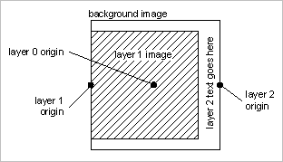

# 예 A{#example-a}

정적 배경 이미지, 즉 왼쪽 중앙에 배경과 정렬되고 배경 너비와 높이의 80%를 초과하지 않도록 크기가 조정된 가변 이미지를 사용하여 고정 크기 템플릿을 만듭니다. 마지막으로 캔버스의 오른쪽 가장자리에 가운데로 세로 텍스트가 있는 텍스트 레이어 하나를 만듭니다.

## 템플릿 레코드 {#section-32f54710593e438fa0622224c89380af}

개체 삽입

<table id="simpletable_97ECA49445634F59B3F1D100412EFC70"> 
 <tr class="strow"> 
  <td class="stentry"> 
  카탈로그::Id  
 </td> 
  <td class="stentry"> 
  myTemplate1  
 </td> 
 </tr> 
 <tr class="strow"> 
  <td class="stentry"> 
  catalog::Modifier  
 </td> 
  <td class="stentry"> 
  src=backgroundImage&amp;size=1000,1000&amp;originN=0,0&amp; layer=1&amp;src=$object$&amp;size=800,800&amp;originN=-0.5,0&amp;posN=-0.5,0&amp; layer=2&amp;$text=layer+2+text+goes+here&amp;text=rtf...$text$...rtf-encoding&amp;rotate=-90&amp;originN=0.5,0&amp;posN=0.5,0  
 </td> 
 </tr> 
</table>

모든 레이어의 `origin=` 값은 레이어의 위치 지정 및 정렬을 엄격하게 제어하기 위해 템플릿에 명시적으로 지정됩니다. 각 레이어 원점은 해당 레이어의 원하는 정렬과 일치하도록 설정됩니다. 배경(레이어 0)에 대한 `origin=`이(가) 가운데로 설정되어 있습니다. 이 값은 런타임에 배경 이미지가 변경되지 않으므로 임의적입니다. 레이어 0 원본의 값을 사용할 수 있습니다.

`pos=` 값은 원하는 레이어 위치를 설정하기 위해 레이어 원점 사이에 필요한 오프셋을 제공합니다.

레이어 1 이미지의 앵커가 `pos=` 값과 함께 왼쪽 가운데에 배치됩니다. 이 설정은 레이어 1 이미지의 종횡비에 관계없이 배경과 레이어 1 이미지 사이에 왼쪽 가운데 정렬을 수행합니다.

마찬가지로 텍스트 레이어의 앵커는 자동 크기 조정 텍스트 상자의 오른쪽 가운데에 `pos=` 값이 있는 위치에 배치됩니다. 이 설정은 글꼴 크기 및 문자열 길이에 관계없이 회전된 텍스트에 대해 원하는 오른쪽 가운데 맞춤을 수행합니다.

실제 표시 텍스트는 런타임에 제공되므로 변수를 사용하여 텍스트 서식을 rtf 서식 범위와 구분합니다. 기본 변수 `$object`이(가) 레이어 1 이미지에 사용됩니다. 이 변수를 사용하면 요청 경로에 이 이미지를 지정할 수 있습니다.

배경 이미지 및 레이어 1 이미지는 어떠한 이미지라도 이용될 수 있다. 배경 이미지에 마스크가 있는 경우 마스크되지 않은 영역은 기본 배경색(`attribute::BkgColor`)으로 채워지거나 `fmt=png-alpha` 또는 `fmt=tif-alpha`일 때 투명한 상태로 유지됩니다. 배경 이미지에 사각형이 아닌 종횡비가 있는 경우 응답 이미지의 가운데에 표시되고 추가 공백은 `attribute::BkgColor`(으)로 채워집니다. 레이어 1 이미지에 알파 데이터나 마스크가 있으면 배경 이미지(또는 배경색)가 투명 영역에 계속 표시됩니다. 이미지에 마스크가 없으면 할당된 사각형 전체를 채웁니다.

## 템플릿 사용 {#section-3e04eedc268c482db5a8cfc662c0f327}

` http:// *`서버`*/myRootId/anotherImage?template=myTemplate1&$text=about+the+image`

다음 이미지는 레이어 1 이미지와 다른 텍스트 문자열의 다른 종횡비에 대한 합성 결과를 보여 줍니다.

