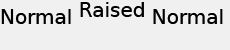

# 텍스트 위치 지정{#text-positioning}

`text=` 렌더러는 크기가 미리 지정된 레이어에 적용할 때 textPs= 렌더러와 근본적으로 다른 텍스트를 배치합니다(즉, size= 도 지정된 경우).

자체 크기 조정 `text=`과 `textPs=` 레이어는 모양과 위치가 비슷합니다.

`textPs=`은(는) 렌더링된 텍스트 글리프의 일부가 텍스트 상자 경계 밖으로 부분적으로 확장되더라도 텍스트 상자의 맨 위에 문자 셀의 상단을 정렬합니다(`\vertalt` 가정). 렌더링된 특정 글꼴의 글리프는 텍스트 상자의 왼쪽 및 오른쪽 가장자리 보다 약간 돌출될 수도 있습니다. 레이어 사각형 안에 렌더링된 모든 텍스트를 포함해야 하는 응용 프로그램의 경우 RTF `\marg*` 명령 또는 `textFlowPath=`을 사용하여 텍스트 렌더링 영역을 조정할 수 있습니다.

반면 `text=`은 렌더링된 텍스트를 필요에 따라 이동하고 렌더링된 모든 글리프가 지정된 텍스트 상자에 완전히 맞도록 합니다.

`text=`은 간단한 응용 프로그램에 사용하기 약간 더 쉽지만 `textPs=`은 글꼴 페이스 및 텍스트 효과와 관계없이 정확한 위치를 제공합니다.

## 예제 {#section-1b6bdf2ea34447528188ae4e1430ee71}

다음 예제는 사전 크기 텍스트입니다. 자체 크기 조정 텍스트에 대한 동작이 다릅니다.

** `Text=`은 항상 맨 위에 작은 여백을 제공합니다.**

`/is/image/?size=230,50&bgc=f0f0f0&fmt=png&text=\fs40Normal%20Normal%20Normal`

** `textPs=` 에서는 텍스트 상자의 맨 위에 정렬된 텍스트를 렌더링하므로, Arial®:** 같은 일반 글꼴에서도 약간 클리핑됩니다.

`/is/image/?size=230,50&bgc=f0f0f0&fmt=png&textPs=\fs40Normal%20Normal%20Normal`

** `text=`은 클리핑을 하지 않도록 렌더링된 텍스트를 자동으로 아래로 이동합니다.**

`/is/image?size=230,50&bgc=f0f0f0&fmt=png&text=\fs40Normal%20{\up20Raised%20}Normal`

** `textPs=` 에서는 증가된 부분이 포함된 텍스트를 이동하지 않으므로 텍스트가 0:**

`/is/image?size=230,50&bgc=f0f0f0&fmt=png&textPs=\fs40Normal%20{\up20Raised%20}Normal`

**맨 위에 있는 10pt(200배) 여백을 사용하여 이 텍스트를 클리핑 없이 렌더링합니다.**

`/is/image?size=230,50&bgc=f0f0f0&fmt=png&textPs=\margt200\fs40Normal%20{\up20Raised}%20Normal`

**특정 스크립트 글꼴의 렌더링된 글리프는 텍스트 상자 외부에서 상당히 확장될 수 있습니다.**

`/is/image?size=230,50&bgc=f0f0f0&fmt=png&textPs={\fonttbl{\f1\fcharset0%20FluffyFont;}}\f1\fs88%20fluffy%20font%20problems`
