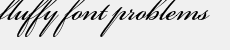

# 텍스트 위치 지정{#text-positioning}

text= 렌더러는 크기가 미리 지정된 레이어에 적용할 때 textPs= 렌더러와 근본적으로 다른 텍스트를 배치합니다(크기=도 지정되었을 때).

자체 크기 `text=`와 `textPs=` 레이어는 모양과 위치가 유사합니다.

`textPs=` 렌더링된 텍스트 글리프의 일부가 텍스트 상자 경계 밖으로 부분적으로 확장되는 경우에도 문자 셀의 위쪽을 텍스트 상자 위쪽( `\vertalt`가정)에 맞춥니다. 특정 글꼴의 렌더링된 글리프는 텍스트 상자의 왼쪽 및 오른쪽 가장자리 약간 돌출되어 있을 수도 있습니다. 렌더링된 모든 텍스트가 레이어 사각형 내에 포함되어야 하는 애플리케이션의 경우 RTF `\marg*` 명령 또는 `textFlowPath=` 명령을 사용하여 텍스트 렌더링 영역을 조정할 수 있습니다.

반대로, `text=`은 필요에 따라 렌더링된 텍스트를 이동하고 렌더링된 모든 글리프가 지정된 텍스트 상자에 완전히 맞도록 합니다.

`text=`은(는) 간단한 응용 프로그램에 사용하기 다소 쉬울 수 있지만 `textPs=`은(는) 글꼴 얼굴 및 텍스트 효과와 상관없이 정확한 위치를 제공합니다.

## 예제 {#section-1b6bdf2ea34447528188ae4e1430ee71}

다음 예제는 크기가 미리 지정된 텍스트입니다. 자체 크기 텍스트의 동작이 다릅니다.

** `Text=`은 항상 맨 위에 좁은 여백을 제공합니다.**

`/is/image/?size=230,50&bgc=f0f0f0&fmt=png&text=\fs40Normal%20Normal%20Normal`

** `textPs=`은 텍스트 상자 위쪽에 정렬된 텍스트를 렌더링하므로 Arial:**와 같은 일반적인 글꼴에 대해서도 약간 클리핑할 수 있습니다.

`/is/image/?size=230,50&bgc=f0f0f0&fmt=png&textPs=\fs40Normal%20Normal%20Normal`

** `text=`은 클리핑을 하지 않도록 렌더링된 텍스트를 아래로 자동으로 이동합니다.**

`/is/image?size=230,50&bgc=f0f0f0&fmt=png&text=\fs40Normal%20{\up20Raised%20}Normal`

** `textPs=`은(는) 증가된 부분을 포함하는 텍스트를 이동하지 않으므로 텍스트가 0:** 레이어에 있으면 상당히 잘리게 됩니다.

`/is/image?size=230,50&bgc=f0f0f0&fmt=png&textPs=\fs40Normal%20{\up20Raised%20}Normal`

**맨 위의 10pt(200배) 여백이 클리핑 없이 이 텍스트를 렌더링합니다.**

`/is/image?size=230,50&bgc=f0f0f0&fmt=png&textPs=\margt200\fs40Normal%20{\up20Raised}%20Normal`

**특정 스크립트 글꼴의 렌더링된 글리프는 텍스트 상자 밖으로 상당히 확장될 수 있습니다.**

`/is/image?size=230,50&bgc=f0f0f0&fmt=png&textPs={\fonttbl{\f1\fcharset0%20FluffyFont;}}\f1\fs88%20fluffy%20font%20problems`
