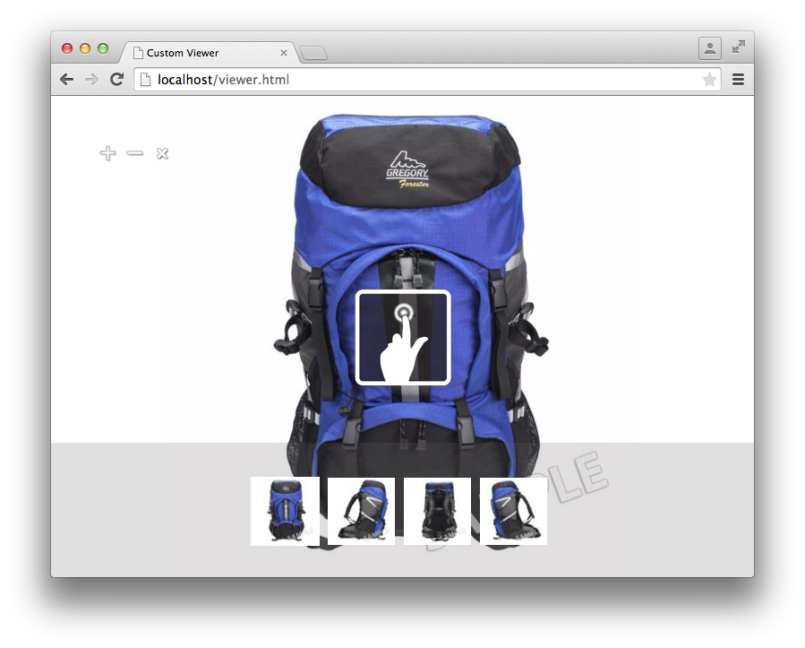

# 뷰어 SDK 자습서{#viewer-sdk-tutorial}

뷰어 SDK는 사용자 정의 뷰어 개발을 위한 JavaScript 기반 구성 요소 집합을 제공합니다. 뷰어는 Adobe Scene7에서 제공하는 리치 미디어 컨텐츠를 웹 페이지에 포함할 수 있도록 허용하는 웹 기반 응용 프로그램입니다.

예를 들어 SDK는 대화형 확대/축소 및 상하좌우 이동을 제공합니다. 또한 SPS(Scene7 Publishing System)라는 백엔드 애플리케이션을 통해 Adobe Scene7에 업로드된 자산의 360° 보기 및 비디오 재생을 제공합니다.

구성 요소는 HTML5 기능을 사용하더라도 Android 및 Apple iOS 장치, Internet Explorer 이상을 비롯한 데스크탑에서 작동하도록 디자인되었습니다. 이러한 종류의 경험은 지원되는 모든 플랫폼에 대해 단일 워크플로우를 제공할 수 있음을 의미합니다.

SDK는 뷰어 콘텐츠를 구성하는 UI 구성 요소로 이루어집니다. CSS를 통해 이러한 구성 요소의 스타일을 지정할 수 있으며 설정 정의 가져오기 및 구문 분석, 추적 등과 같이 지원 역할을 하는 비-UI 구성 요소를 통해 스타일을 지정할 수 있습니다. 모든 구성 요소 비헤이비어는 다양한 방법으로 지정할 수 있는 수정자를 통해 사용자 정의할 수 있습니다(예: URL의 `name=value` 쌍).

이 자습서에는 기본 확대/축소 뷰어를 만드는 데 도움이 되는 다음 작업 순서가 포함되어 있습니다.

* [Adobe Developer Connection에서 최신 뷰어 SDK 다운로드](c-tutorial.md#section-84dc74c9d8e24a2380b6cf8fc28d7127)
* [뷰어 SDK 로드](c-tutorial.md#section-98596c276faf4cf79ccf558a9f4432c6)
* [뷰어에 스타일 추가](c-tutorial.md#section-3783125360a1425eae5a5a334867cc32)
* [컨테이너 및 확대/축소 보기 포함](c-tutorial.md#section-1a01730663154a508b88cc40c6f35539)
* [뷰어에 MediaSet 및 색상 견본 구성 요소 추가](c-tutorial.md#section-02b8c21dd842400e83eae2a48ec265b7)
* [뷰어에 단추 추가](c-tutorial.md#section-1fc334fa0d2b47eb9cdad461725c07be)
* [색상 견본 수직 구성](c-tutorial.md#section-91a8829d5b5a4d45a35b7faeb097fcc9)

## Adobe Developer Connection {#section-84dc74c9d8e24a2380b6cf8fc28d7127}에서 최신 뷰어 SDK 다운로드

1. Adobe Developer Connection [여기](https://marketing.adobe.com/developer/devcenter/scene7/show)에서 최신 뷰어 SDK를 다운로드합니다.

   >[!NOTE]
   >
   >SDK가 실제로 원격으로 로드되므로 Viewer SDK 패키지를 다운로드할 필요 없이 이 자습서를 완료할 수 있습니다. 그러나 뷰어 패키지에는 뷰어를 직접 만들 때 유용한 예를 찾을 수 있는 추가 예와 API 참조 안내서가 포함되어 있습니다.

## 뷰어 SDK {#section-98596c276faf4cf79ccf558a9f4432c6} 로드

1. 새로 페이지를 설정하여 만들려는 기본 확대/축소 뷰어를 개발합니다.

   빈 SDK 응용 프로그램을 설정할 코드를 부트스트랩 또는 로더로 간주합니다. 즐겨 사용하는 텍스트 편집기를 열고 다음 HTML 마크업을 해당 편집기에 붙여넣습니다.

   ```
   <!DOCTYPE html> 
   <html> 
       <head> 
           <meta http-equiv="Content-Type" content="text/html; charset=utf-8" /> 
           <meta name="viewport" content="user-scalable=no, height=device-height, width=device-width, initial-scale=1.0, maximum-scale=1.0"/> 
   
           <!-- Hiding the Safari on iPhone OS UI components --> 
           <meta name="apple-mobile-web-app-capable" content="yes"/> 
           <meta name="apple-mobile-web-app-status-bar-style" content="black"/> 
           <meta name="apple-touch-fullscreen" content="no"/> 
   
           <title>Custom Viewer</title> 
   
           <!-- 
               Include Utils.js before you use any of the SDK components. This file  
               contains SDK utilities and global functions that are used to initialize the viewer and load viewer  
               components. The path to the Utils.js determines which version of the SDK that the viewer uses. You  
               can use a relative path if the viewer is deployed on one of the Adobe Scene7 servers and it is served  
               from the same domain. Otherwise, specify a full path to one of Adobe Scene7 servers that have the SDK  
               installed.  
           --> 
           <script language="javascript" type="text/javascript"      
                   src="http://s7d1.scene7.com/s7sdk/2.8/js/s7sdk/utils/Utils.js"></script> 
   
       </head> 
       <body> 
           <script language="javascript" type="text/javascript"> 
           </script>  
       </body> 
   </html>
   ```

   `script` 태그 내에 다음 JavaScript 코드를 추가하여 `ParameterManager`을(를) 초기화합니다. 이렇게 하면 `initViewer` 함수 내에서 SDK 구성 요소를 만들고 인스턴스화할 준비를 할 수 있습니다.

   ```
   /* We create a self-running anonymous function to encapsulate variable scope. Placing code inside such 
      a function is optional, but this prevents variables from polluting the global object.  */ 
   (function () { 
   
       // Initialize the SDK   
       s7sdk.Util.init(); 
   
       /* Create an instance of the ParameterManager component to collect components' configuration 
          that can come from a viewer preset, URL, or the HTML page itself. The ParameterManager  
          component also sends a notification s7sdk.Event.SDK_READY when all needed files are loaded 
          and the configuration parameters are processed. The other components should never be initialized 
          outside this handler. After defining the handler for the s7sdk.Event.SDK_READY event, it 
          is safe to initiate configuration initialization by calling ParameterManager.init(). */ 
       var params = new s7sdk.ParameterManager(); 
   
       /* Event handler for s7sdk.Event.SDK_READY dispatched by ParameterManager to initialize various components of  
          this viewer. */ 
       function initViewer() { 
   
       }  
   
       /* Add event handler for the s7sdk.Event.SDK_READY event dispatched by the ParameterManager when all modifiers 
          are processed and it is safe to initialize the viewer. */ 
       params.addEventListener(s7sdk.Event.SDK_READY, initViewer, false); 
   
       /* Initiate configuration initialization of ParameterManager. */ 
       params.init(); 
   
   }());
   ```

1. 파일을 빈 템플릿으로 저장합니다. 원하는 파일 이름을 사용할 수 있습니다.

   나중에 새 뷰어를 만들 때 이 빈 템플릿 파일을 참조로 사용합니다. 이 템플릿은 로컬에서 그리고 웹 서버에서 제공될 때 작동합니다.

이제 뷰어에 스타일을 추가합니다.

## 뷰어에 스타일 추가 {#section-3783125360a1425eae5a5a334867cc32}

1. 만들고 있는 이 전체 페이지 뷰어의 경우 몇 가지 기본 스타일을 추가할 수 있습니다.

   `head` 아래쪽에 다음 `style` 블록을 추가합니다.

   ```
   <style> 
       html, body { 
           width: 100%; 
           height: 100%; 
       } 
       body { 
           /* Remove any padding and margin around the edges of the browser window */ 
           padding: 0; 
           margin: 0; 
   
           /* We set overflow to hidden so that scroll bars do not flicker when resizing the window */ 
           overflow: hidden; 
       } 
   </style>
   ```

이제 구성 요소 `Container` 및 `ZoomView`을(를) 포함합니다.

## 컨테이너 및 ZoomView {#section-1a01730663154a508b88cc40c6f35539} 포함

1. 구성 요소 `Container` 및 `ZoomView`을 포함하여 실제 뷰어를 만듭니다.

   [!DNL Utils.js] 스크립트가 로드된 후 다음 `<head>` 요소 아래에 `include` 문을 삽입합니다.

   ```
   <!-- 
       Add an "include" statement with a related module for each component that is needed for that particular  
       viewer. Check API documentation to see a complete list of components and their modules. 
   --> 
   <script language="javascript" type="text/javascript"> 
       s7sdk.Util.lib.include('s7sdk.common.Container');  
       s7sdk.Util.lib.include('s7sdk.image.ZoomView');  
   </script>
   ```

1. 이제 다양한 SDK 구성 요소를 참조하는 변수를 만듭니다.

   다음 변수를 기본 익명 함수 맨 위에 `s7sdk.Util.init()` 바로 위에 추가합니다.

   ```
   var container, zoomView;
   ```

1. `initViewer` 함수 내에 다음을 삽입하여 일부 수정자를 정의하고 각 구성 요소를 인스턴스화합니다.

   ```
   /* Modifiers can be added directly to ParameterManager instance */ 
   params.push("serverurl", "http://s7d1.scene7.com/is/image"); 
   params.push("asset", "Scene7SharedAssets/ImageSet-Views-Sample"); 
   
   /* Create a viewer container as a parent component for other user interface components that  
      are part of the viewer application and associate event handlers for resize and  
      full screen notification. The advantage of using Container as the parent is the  
      component's ability to resize and bring itself and its children to full screen. */ 
   container = new s7sdk.common.Container(null, params, "s7container"); 
   container.addEventListener(s7sdk.event.ResizeEvent.COMPONENT_RESIZE, containerResize, false); 
   
   /* Create ZoomView component */ 
   zoomView = new s7sdk.image.ZoomView("s7container", params, "myZoomView");  
   
   /* We call this to ensure all SDK components are scaled to initial conditions when viewer loads */ 
   resizeViewer(container.getWidth(), container.getHeight());
   ```

1. 위의 코드가 제대로 실행하려면 `containerResize` 이벤트 핸들러와 도우미 함수를 추가합니다.

   ```
   /* Event handler for s7sdk.event.ResizeEvent.COMPONENT_RESIZE events dispatched by Container to resize 
      various view components included in this viewer. */ 
   function containerResize(event) { 
       resizeViewer(event.s7event.w, event.s7event.h); 
   } 
   
   /* Resize viewer components */ 
   function resizeViewer(width, height) { 
       zoomView.resize(width, height); 
   }
   ```

1. 만든 내용을 볼 수 있도록 페이지를 미리 봅니다. 페이지는 다음과 같습니다.

   

이제 구성 요소 `MediaSet` 및 `Swatches`을 뷰어에 추가합니다.

## 뷰어 {#section-02b8c21dd842400e83eae2a48ec265b7}에 MediaSet 및 견본 구성 요소 추가

1. 사용자가 세트에서 이미지를 선택할 수 있도록 하려면 구성 요소 `MediaSet` 및 `Swatches`을(를) 추가할 수 있습니다.

   다음과 같은 SDK를 추가합니다.

   ```
   s7sdk.Util.lib.include('s7sdk.set.MediaSet'); 
   s7sdk.Util.lib.include('s7sdk.set.Swatches');
   ```

1. 변수 목록을 다음과 같이 업데이트합니다.

   ```
   var mediaSet, container, zoomView, swatches;
   ```

1. `initViewer` 함수 내에서 `MediaSet` 및 `Swatches` 구성 요소를 인스턴스화합니다.

   `ZoomView` 및 `Container` 구성 요소 뒤에 `Swatches` 인스턴스를 인스턴스화해야 합니다. 그렇지 않으면 누적 순서가 `Swatches`을 숨깁니다.

   ```
   // Create MediaSet to manage assets and add event listener to the NOTF_SET_PARSED event 
   mediaSet = new s7sdk.set.MediaSet(null, params, "mediaSet"); 
   
   // Add MediaSet event listener 
   mediaSet.addEventListener(s7sdk.event.AssetEvent.NOTF_SET_PARSED, onSetParsed, false); 
   
   /* create Swatches component and associate event handler for swatch selection notification */ 
   swatches = new s7sdk.set.Swatches("s7container", params, "mySwatches");   
   swatches.addEventListener(s7sdk.event.AssetEvent.SWATCH_SELECTED_EVENT, swatchSelected, false);
   ```

1. 이제 다음 이벤트 핸들러 함수를 추가합니다.

   ```
   /* Event handler for the s7sdk.event.AssetEvent.NOTF_SET_PARSED event dispatched by MediaSet to 
      assign the asset to the Swatches when parsing is complete. */ 
   function onSetParsed(e) { 
   
       // set media set for Swatches to display  
       var mediasetDesc = e.s7event.asset;  
       swatches.setMediaSet(mediasetDesc); 
   
       // select the first swatch by default  
       swatches.selectSwatch(0, true);      
   } 
   
   /* Event handler for s7sdk.event.AssetEvent.SWATCH_SELECTED_EVENT events dispatched by Swatches to switch 
      the image in the ZoomView when a different swatch is selected. */ 
   function swatchSelected(event) {     
       zoomView.setItem(event.s7event.asset);  
   }
   ```

1. 다음 CSS를 `style` 요소에 추가하여 뷰어 아래쪽에 견본을 배치합니다.

   ```
   /* Align swatches to bottom of viewer */ 
   .s7swatches { 
       bottom: 0; 
       left: 0; 
       right: 0; 
       height: 150px; 
   }
   ```

1. 뷰어를 미리 봅니다.

   견본은 뷰어의 왼쪽 하단에 있습니다. 색상 견본을 전체 뷰어 폭으로 사용하려면 사용자가 브라우저 크기를 조정할 때마다 색상 견본 크기를 수동으로 조정하는 호출을 추가합니다. `resizeViewer` 함수에 다음을 추가합니다.

   ```
   swatches.resize(width, swatches.getHeight());
   ```

   이제 뷰어가 다음 이미지와 같습니다. 뷰어의 브라우저 창 크기를 조절해 보고 그에 따른 동작을 확인합니다.

   

이제 뷰어에 확대, 축소 및 확대/축소 재설정 단추를 추가합니다.

## 뷰어에 단추 추가 {#section-1fc334fa0d2b47eb9cdad461725c07be}

1. 현재 사용자는 클릭 또는 터치 제스처만 사용하여 확대할 수 있습니다. 따라서 뷰어에 몇 가지 기본 확대/축소 제어 단추를 추가합니다.

   다음 단추 구성 요소를 추가합니다.

   ```
   s7sdk.Util.lib.include('s7sdk.common.Button');
   ```

1. 변수 목록을 다음과 같이 업데이트합니다.

   ```
   var mediaSet, container, zoomView, swatches, zoomInButton, zoomOutButton, zoomResetButton;
   ```

1. `initViewer` 함수 아래쪽에 있는 버튼을 인스턴스화합니다.

   CSS에서 `z-index`을 지정하지 않으면 순서가 중요합니다.

   ```
   /* Create Zoom In, Zoom Out and Zoom Reset buttons */ 
   zoomInButton  = new s7sdk.common.ZoomInButton("s7container", params, "zoomInBtn"); 
   zoomOutButton = new s7sdk.common.ZoomOutButton("s7container", params, "zoomOutBtn"); 
   zoomResetButton = new s7sdk.common.ZoomResetButton("s7container", params, "zoomResetBtn"); 
   
   /* Add handlers for zoom in, zoom out and zoom reset buttons inline. */ 
   zoomInButton.addEventListener("click", function() { zoomView.zoomIn(); }); 
   zoomOutButton.addEventListener("click", function() { zoomView.zoomOut(); }); 
   zoomResetButton.addEventListener("click", function() { zoomView.zoomReset(); });
   ```

1. 이제 파일 맨 위에 있는 `style` 블록에 다음을 추가하여 단추의 몇 가지 기본 스타일을 정의합니다.

   ```
   /* define styles common to all button components and their sub-classes */ 
   .s7button { 
       position:absolute; 
       width: 28px; 
       height: 28px; 
       z-index:100; 
   } 
   
   /* position individual buttons*/ 
   .s7zoominbutton  { 
       top: 50px; 
       left: 50px; 
    } 
   .s7zoomoutbutton  { 
       top: 50px; 
       left: 80px; 
    } 
   .s7zoomresetbutton  { 
       top: 50px; 
       left: 110px; 
    }
   ```

1. 뷰어를 미리 봅니다. 다음과 같습니다.

   

   이제 견본이 오른쪽에 세로로 정렬되도록 구성합니다.

## 견본 수직 구성 {#section-91a8829d5b5a4d45a35b7faeb097fcc9}

1. `ParameterManager` 인스턴스에서 직접 수정자를 구성할 수 있습니다.

   `initViewer` 함수 맨 위에 다음을 추가하여 `Swatches` thumb 레이아웃을 단일 행으로 구성합니다.

   ```
   params.push("Swatches.tmblayout", "1,0");
   ```

1. `resizeViewer` 내에서 다음 크기 조정 호출을 업데이트합니다.

   ```
   swatches.resize(swatches.getWidth(), height);
   ```

1. `ZoomViewer.css`에서 다음 `s7swatches` 규칙을 편집합니다.

   ```
   .s7swatches { 
       top:0 ; 
       bottom: 0; 
       right: 0; 
       width: 150px; 
   }
   ```

1. 뷰어를 미리 봅니다. 다음과 같습니다.

   

   기본 확대/축소 뷰어가 이제 완료되었습니다.

   이 뷰어 자습서는 Scene7 Viewer SDK에서 제공하는 내용의 기본 사항을 살펴봅니다. SDK를 사용하여 작업할 때 다양한 표준 구성 요소를 사용하여 대상 고객을 위한 풍부한 보기 경험을 쉽게 만들고 스타일을 지정할 수 있습니다.

